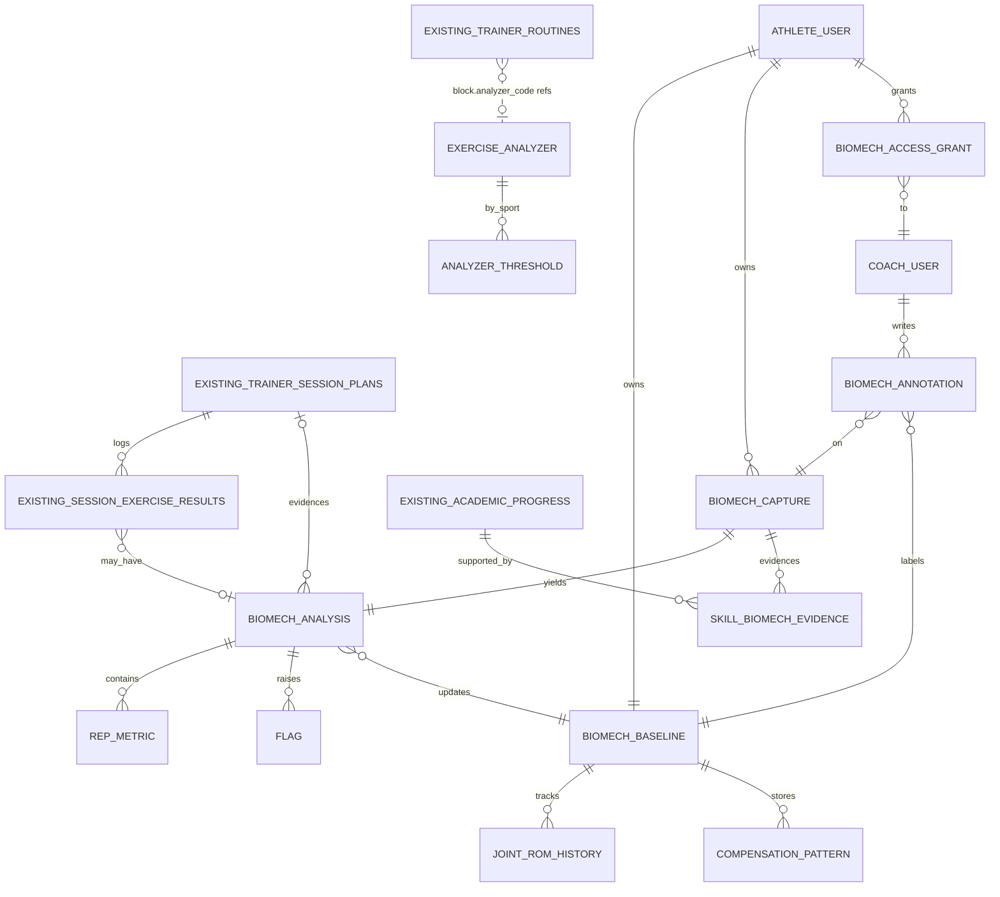

# SportMaps Body — Análisis biomecánico aumentado por IA

> Módulo de análisis biomecánico para entrenadores personales, integrado dentro de SportMaps como capa sobre el módulo de personal trainer existente.

**Estado:** Análisis y diseño cerrados. Próximo paso: DDL e implementación.
**Fecha:** 2026-05-08
**Autoría:** sesión de diseño Brayan + Claude

---

## 1. Propuesta de valor en una frase

> **"La IA hace el trabajo repetitivo (analizar, prescribir, validar, recordar). El humano hace el trabajo emocional (motivar, ajustar, conectar)."**

Cualquier feature, decisión de schema, o endpoint debe evaluarse contra esa frase. Si no la sirve, no entra al MVP.

---

## 2. Origen y evolución del análisis

El análisis comenzó como una pregunta abierta sobre PlayCanvas y derivó en un módulo de producto. Las pivotaciones clave:

| Iteración | Idea | Por qué se descartó / refinó |
|---|---|---|
| 1. PlayCanvas para SportMaps | "Visualizaciones 3D de canchas" | Demasiado genérico, sin foco. La mayoría se resuelve mejor en 2D (Konva/Pixi). |
| 2. PlayCanvas para entrenadores | Pizarra táctica 3D animada | Buen caso, pero no es el más disruptivo. |
| 3. PlayCanvas + FreeMoCap | Análisis biomecánico para coaches personales | **Sí.** Disruptivo, mercado claro, tecnología accesible. |
| 4. "6 casos de uso" iniciales | Análisis técnico, comparación, tracking, rehab, verificación, etc. | Diluido. Hay UN caso killer: análisis técnico asíncrono. |
| 5. "Coach aumentado" (10 pilares) | Builder + demo + verificación + coaching live + progresión + comms... | Scope infinito. Riesgo opuesto. |
| 6. Capa biomecánica sobre lo existente | Insertar en el módulo trainer ya construido | **Decisión final.** Aprovecha 12+ tablas, RPCs, RLS y UI ya maduros. |
| 7. Hybrid en ClientProgressTab | No tab separada, sí enriquecimiento del flujo de evaluación de skills | **Decisión final.** Cierra el feedback loop coach ↔ datos objetivos. |

---

## 3. El insight central que hace al producto defensible

No es la tecnología. MediaPipe, FreeMoCap, PlayCanvas son commodities accesibles para cualquier competidor.

Lo defensible es **el grafo de contexto que SportMaps ya tiene**:

- El atleta ya existe en el sistema (perfil, escuela, deporte, edad, historial médico).
- El coach tiene relación establecida con la escuela.
- Los pagos fluyen vía SportMaps Pay.
- La agenda física ya está reservada (sabemos cuándo entrena y dónde).
- El plan de sesiones, la asistencia, las métricas corporales ya viven en la misma DB.

Cuando el sistema detecta valgo de rodilla en una sentadilla, no solo dice *"ejercicios correctivos genéricos"*. Dice:

> *"Tu próxima sesión en el gimnasio X es jueves, tu coach ahí es Andrés, y acá están los ejercicios correctivos que él va a programarte ese día — basados en la baseline biomecánica que llevás 6 semanas construyendo."*

Eso es lo que un app de fitness standalone (Trainerize, MyFitnessPal, Tonal) **no puede replicar** sin construir primero todo el ecosistema deportivo.

---

## 4. El feedback loop cerrado (la pieza realmente disruptiva)

```
Coach evalúa skill (subjetivo: 7/10)
        ↓
Adjunta biomech_capture como evidencia
        ↓
Capture queda etiquetada con criterio del coach
        ↓
Modelo aprende qué considera "7/10" ESE coach
        ↓
En próximas capturas, sistema preflagea casos similares
        ↓
Coach dedica tiempo solo a edge cases, no a triaje
```

Eso es lo que escala a un coach de 10 a 100 clientes sin perder calidad. Y es lo que **convierte cada anotación humana en dato entrenable** — un activo que crece con el uso.

---

## 5. El atleta como dueño de su perfil biomecánico

Decisión de modelo de poder, no solo técnica:

- `BIOMECH_BASELINE` está scoped por `athlete_id`, **no** por `coach_id`.
- Coaches existen como permisos otorgados (`biomech_access_grants`), no como dueños del dato.
- Cuando el atleta cambia de trainer, el nuevo no ve el histórico hasta que el atleta otorga acceso.
- Atleta puede exportar/descargar su perfil completo (compliance + portabilidad).

Eso invierte el modelo tradicional donde el coach acumula el conocimiento del cliente. Acá el atleta es root del grafo, los coaches son colaboradores temporales.

**Implicación de negocio:** habilita revenue stream B2C directo. El atleta paga por acceso a su perfil biomecánico permanente, independiente de qué coach contrate.

---

## 6. Casos de uso priorizados

### MVP (sprint 1-2)

| # | Caso | Por qué primero |
|---|---|---|
| 1 | **Análisis técnico asíncrono de 1 ejercicio** | El killer. Reemplaza el "WhatsApp + ojo humano" que usan 95% de coaches LATAM. |
| 2 | **Verificación de ejecución (auto rep counting + form check)** | Convierte el plan en accountability real. Driver de retención. |
| 3 | **Tracking longitudinal del baseline** | Mostrar al atleta semana 1 vs semana 12 = retention infinita. |
| 4 | **Skill evaluation enriquecida con evidencia** | Cierra el feedback loop, hace al sistema entrenable. |

### V2 (sprint 3-4)

| # | Caso | Por qué después |
|---|---|---|
| 5 | **IA que diagnostica + prescribe** | "Valgo de rodilla → debilidad de glúteo medio → ejercicios X". Requiere data inicial del MVP para entrenar reglas. |
| 6 | **Comparación side-by-side con referencia** | Nice-to-have. No mueve la aguja sin los anteriores. |
| 7 | **Variantes específicas por deporte (porrismo, powerlifting, calistenia)** | Diferenciador competitivo, requiere curatoría humana experta por deporte. |

### V3+ (futuro)

| # | Caso | Por qué último |
|---|---|---|
| 8 | **Coaching en vivo con overlay de pose** | Técnicamente caro (WebRTC + pose en tiempo real). |
| 9 | **FreeMoCap multi-cámara para precisión clínica** | Setup complicado, mercado nicho. |
| 10 | **Marketplace de coaches con perfil técnico verificado** | Requiere base instalada de captures primero. |
| 11 | **Integración con wearables (HR, IMU, fuerza)** | Data layer extra, decoupled. |

---

## 7. Casos de uso explícitamente fuera de scope

Para evitar scope creep:

- **Plataforma genérica de fitness home.** No competimos con Apple Fitness+, Peloton, Nike Training Club.
- **Diagnóstico clínico médico.** Cámara única tiene precisión ±5-10° en ángulos articulares — útil para feedback de coaching, **insuficiente** para decisiones médicas. Disclaimer obligatorio.
- **AR de estadísticas en tiempo real.** Demo cool, valor comercial bajo en LATAM hoy.
- **Análisis de partidos completos / scouting.** Otro mercado (clubes pro), otro stack.

---

## 8. Arquitectura: módulo dentro de SportMaps, marca diferenciada

**Decisión:** producto-línea **"SportMaps Body"** (paralelo a "SportMaps Pay"), no spin-off, no módulo invisible.

| Aspecto | Decisión |
|---|---|
| DB | Compartida con SportMaps core (Supabase Postgres) |
| Auth | Compartida (Supabase Auth + roles existentes) |
| Pagos | Vía SportMaps Pay (Wompi + MercadoPago) |
| RLS | Extendido — el atleta es root del grafo biomecánico |
| Frontend | Componentes nuevos integrados en rutas existentes (`/trainer/clients/:id`) |
| Marca | "SportMaps Body" en UI cuando se accede a features biomecánicas |

**Por qué no spin-off:** la propuesta de valor solo funciona si la clase de educación física en la escuela, el entrenamiento del club y la sesión con el coach personal alimentan el mismo expediente. Separar técnicamente rompe exactamente lo que hace al producto defensible.

**Por qué no módulo invisible:** las 10 features identificadas no son features de SportMaps — son un negocio con su propia ICP, pricing y go-to-market. Necesitan branding propio para no confundir al usuario que entra por flujo de escuela.

---

## 9. Análisis del codebase existente

Antes de diseñar nada nuevo, leímos el código actual y encontramos un **módulo de personal trainer maduro y en producción**:

### Tablas activas relevantes

| Tabla | Rol | Reuso para biomecánica |
|---|---|---|
| `trainer_routines` | Biblioteca de rutinas con `blocks` JSONB | **Es** el builder. Agregamos campo `analyzer_code` por bloque. |
| `trainer_session_plans` | Sesiones asignadas a clientes | Hook donde se cuelga la captura biomecánica. |
| `session_exercise_results` | Resultados set-by-set (reps, peso, RPE) | Agregamos FK opcional a `biomech_analyses`. |
| `athlete_training_plans` | Plan semanal | Sin cambios. |
| `training_logs` | Actividad libre del atleta | Contenedor para autoanálisis voluntario. |
| `body_metrics` | Peso, %grasa, perímetros | Sin cambios. |
| `trainer_profiles` | Perfil del trainer | Sin cambios. |
| `coach_availability` | Agenda del coach | Sin cambios. |
| `enrollments` + `offering_plans` | Créditos/sesiones, descuento automático | Gating premium ("offering incluye biomech"). |
| `schools` con `school_type='personal_trainer'` | Contexto distinguido | Filtro para activar features biomech. |
| `academic_progress` | Skills subjetivas evaluadas por coach | **Punto de fusión** del feedback loop. |

### RPCs ya operativas

- `fn_create_plan_from_routine` — convierte rutina en plan asignado
- `fn_complete_session_plan` — completar + descontar crédito atómicamente
- `fn_book_pt_session` / `fn_cancel_pt_session` — agendamiento

### Frontend ya construido

- [TrainerRoutines.tsx](../../frontend/src/pages/trainer/TrainerRoutines.tsx) — biblioteca
- [RoutineFormModal.tsx](../../frontend/src/components/trainer/RoutineFormModal.tsx) — builder
- [SessionPlanModal.tsx](../../frontend/src/components/trainer/SessionPlanModal.tsx) — asignación
- [SessionExecution.tsx](../../frontend/src/components/athlete/SessionExecution.tsx) — ejecución del atleta (**aquí se inserta la cámara biomecánica**)
- [TrainerClientProfile.tsx](../../frontend/src/pages/trainer/TrainerClientProfile.tsx) con tabs `Resumen / Métricas / Objetivos / Sesiones / Habilidades / Plan`
- [ClientProgressTab.tsx](../../frontend/src/pages/trainer/tabs/ClientProgressTab.tsx) — radar de skills (**aquí se inserta la evidencia biomecánica**)

### Catálogo de ejercicios

- `bff/src/data/exercises.json` + integración con **wger** (API open-source)
- Multi-idioma vía `hydrateBlocksWithLocalTranslations`

---

## 10. Decisiones de diseño cerradas

### A. Módulo paralelo vs capa sobre lo existente
**Decisión:** capa sobre lo existente. **Razón:** aprovechar 12+ tablas y 4+ RPCs maduras, no fragmentar el dato del atleta.

### B. Activación del análisis: opt-in por bloque vs automático por exercise_key
**Decisión:** opt-in por bloque (`blocks[].analyzer_required: true` + `blocks[].analyzer_code`). **Razón:** el trainer controla cuándo gastar procesamiento y abrumar al atleta con cámara.

### C. Update del baseline: en cada análisis vs solo en assessments formales
**Decisión:** rolling con weighting por contexto (assessment formal pesa 5x más que rep aleatoria). **Razón:** maximiza el dato sin diluir señal con ruido.

### D. Beta cerrada: porrismo vs powerlifting/calistenia
**Pendiente de confirmar.** Si Liga Bogotana de Porrismo está confirmada, los `EXERCISE_ANALYZER` se diseñan con su staff técnico. Si es aspiracional, abrimos con powerlifting/calistenia (más reglas ya documentadas en literatura).

### E. Quién inicia el análisis
**Decisión:** dominante `trainer-assigns → athlete-executes` (mismo patrón que el módulo trainer hoy). Excepción: atleta puede correr autoanálisis voluntario desde su perfil biomecánico.

### F. Quién ve los resultados
**Decisión:**
- Atleta: dueño del análisis, ve todo su histórico siempre (RLS scoped por `athlete_id`).
- Trainer: ve análisis de planes que él asignó **o** de clientes con `biomech_access_grant` activo.
- `BIOMECH_BASELINE`: solo atleta + coaches con grant activo. Si cambia de trainer, el nuevo no ve histórico hasta que el atleta otorga acceso.

### G. Builder propio vs conectado al existente
**Decisión:** conectado al existente. `trainer_routines.blocks` ya es el builder maduro y validado en producción.

### H. Integración en UI: tab separada vs híbrido en ProgressTab
**Decisión:** híbrido. La biomecánica enriquece la evaluación de skills existente:
- Skills con evidencia biomecánica muestran ícono especial; click abre video + métricas.
- Sección nueva "Biomecánica" dentro del tab para captures sin skill asociada.
- Histórico unificado cronológico.

### I. Relación skill_evaluation ↔ biomech_capture
**Decisión:** many-to-many vía tabla junction `skill_biomech_evidence`. **Razón:** una evaluación puede tener N capturas como evidencia, y una captura puede respaldar múltiples skills (la misma sentadilla evidencia "profundidad" y "simetría").

---

## 11. Modelo de entidades (vista atleta-céntrica)



### Las 4 piezas que el modelo hace explícitas

**1. `ATHLETE_PROFILE` + `BIOMECH_BASELINE` son el núcleo, no el programa.**
El programa es contenido temporal; el baseline es el activo permanente. Cada análisis lo actualiza, cada coach lo lee.

**2. `BIOMECH_ACCESS_GRANT` es la pieza política del modelo.**
El atleta es root. Coaches existen como permisos otorgados, no como dueños. RLS policies refuerzan esto a nivel DB.

**3. `BIOMECH_ANNOTATION → BIOMECH_BASELINE` cierra el feedback loop.**
Cada anotación del coach es dato etiquetado que entrena el detector de flags del atleta. La columna que conecta UI humana con modelo aprendido.

**4. `SKILL_BIOMECH_EVIDENCE` es la junction many-to-many.**
Permite que una evaluación subjetiva del coach se respalde con N capturas, y que una captura sirva como evidencia de N skills.

---

## 12. Plan de implementación

### Sprint 1 — Foundations (2 semanas)

**DB:**
- Migración con tablas: `biomech_captures`, `biomech_analyses`, `biomech_baselines`, `biomech_annotations`, `biomech_access_grants`, `skill_biomech_evidence`, `exercise_analyzers`
- RLS policies con atleta como root
- ALTER `session_exercise_results` para FK opcional a `biomech_analyses`
- Seed de 3 analyzers: `squat`, `vertical_jump`, `hip_extension`
- Storage bucket `biomech-videos` con políticas

**BFF:**
- `POST /api/v1/biomech/captures` — crear captura + presigned upload URL
- `POST /api/v1/biomech/captures/:id/keypoints` — recibir keypoints del cliente
- `POST /api/v1/biomech/captures/:id/analyze` — disparar análisis (síncrono inicial)
- `GET /api/v1/biomech/captures/:id` — incluye analysis + flags
- `POST /api/v1/biomech/skills/:skillId/evidence` — adjuntar capturas a skill evaluation
- `GET /api/v1/biomech/baselines/:athleteId` — leer baseline (con verificación de access_grant)

**Frontend:**
- Componente `BiomechCaptureModal` con MediaPipe Tasks Vision en cliente
- Botón "Capturar movimiento" en `ClientProgressTab`
- Sección "Biomecánica" dentro del tab con thumbnails + métricas básicas
- Ícono de evidencia en skills con captures asociadas

### Sprint 2 — Loop completo (2 semanas)

- `BiomechReviewView` — coach revisa captura con timeline + anotaciones timestamped
- PlayCanvas integration: avatar 3D que reproduce los keypoints
- Cálculo de métricas: depth, valgus, asymmetry, ROM por articulación
- Verificación automática de reps en `SessionExecution.tsx`
- Trigger de captura desde un block con `analyzer_required: true`

### Sprint 3 — Inteligencia (2 semanas)

- Update automático del `BIOMECH_BASELINE` con weighting por contexto
- Comparativo longitudinal (semana 1 vs actual)
- Diagnóstico básico via reglas (`flags → suggested_corrective_exercises`)
- Notificaciones al coach cuando un cliente tiene flags críticos

### Sprint 4 — Beta cerrada

- Onboarding del primer coach + 10 atletas piloto
- Iteración rápida con feedback real
- Métricas de adopción: % sesiones con captura, tiempo de revisión del coach, NPS

---

## 13. Modelo de negocio

### Revenue stream dual

**B2C — Atleta paga suscripción base** (`SportMaps Body Athlete`):
- Acceso a su perfil biomecánico permanente
- Verificación automática de ejecución de rutinas
- Histórico ilimitado de capturas
- Comparativos longitudinales
- Pricing tentativo: $5-10 USD/mes

**B2B — Coach paga herramientas** (`SportMaps Body Pro`):
- Análisis premium con FreeMoCap multi-cámara (V3)
- Gestión de equipos (>10 clientes)
- Anotaciones masivas + plantillas
- Estadísticas de adherencia agregadas
- Marketplace de leads (V2+)
- Pricing tentativo: $20-30 USD/coach/mes

### Por qué dual

- Reduce dependencia de adquisición B2B (más lenta, ciclo de venta largo).
- Los datos generan valor B2C aunque el coach no esté presente (el atleta puede usar la app independientemente).
- Cada lado del marketplace paga por su valor incremental, no por el producto base.

### Unit economics tentativos (LATAM)

- ARPU coach: ~$25 USD/mes × 50 coaches piloto = $1,250/mes
- ARPU atleta: ~$7 USD/mes × 500 atletas (10 por coach) = $3,500/mes
- Total: ~$4,750/mes a fin de Q1 post-launch
- Costos: storage de videos (~$0.20/atleta/mes), procesamiento (~$0.10/captura)

---

## 14. Riesgos y mitigaciones

| Riesgo | Severidad | Mitigación |
|---|---|---|
| Precisión de cámara única (±5-10° en ángulos) | Alta | Disclaimer claro: "feedback de coaching, no diagnóstico clínico". Multi-cámara para tier premium V3. |
| Iluminación / ropa afecta detección | Media | UX guiada en captura: fondo claro, ropa contrastante, distancia estándar. Calidad mínima de input. |
| Storage de videos crece rápido | Media | Política de retención: 90 días free, 1 año premium. Eliminar video original después de extraer keypoints (los keypoints pesan <1% del video). |
| Privacidad: video del cuerpo es dato sensible | Alta | RLS estricto + cifrado en reposo + opt-in explícito + GDPR-ready (export + delete). |
| Adopción del coach: cambia su flujo | Media | Patrón híbrido (no rompe ProgressTab existente) + onboarding guiado + casos de éxito visuales. |
| Adopción del atleta: friction al grabar | Media | Recordatorios push contextual + gamificación (streak de capturas) + social proof (ver progreso del coach). |
| Competencia (Trainerize agrega biomech) | Baja | Diferenciador: contexto del ecosistema deportivo (escuela + agenda + pagos). No replicable sin construir SportMaps primero. |
| Compliance médico (rehab) | Media | Para `wellness_professional` agregar disclaimer + compliance específico HIPAA-equivalent en LATAM. V2+. |

---

## 15. Tradeoffs explícitos asumidos

- **Precisión vs accesibilidad:** elegimos cámara única (móvil) sobre multi-cámara. Perdemos precisión clínica, ganamos 100x el TAM.
- **Server-side vs on-device:** elegimos on-device (MediaPipe en cliente) para MVP. Perdemos algo de calidad, ganamos 0 costo de infra y privacidad reforzada.
- **Builder propio vs reuso:** elegimos reuso del `trainer_routines.blocks`. Perdemos flexibilidad de schema biomecánico-específico, ganamos 6+ meses de trabajo evitado.
- **Tab separada vs híbrido:** elegimos híbrido. Perdemos visibilidad de la feature como producto distinto, ganamos coherencia de UX y feedback loop más fuerte.
- **Atleta-root vs Coach-root del dato:** elegimos atleta-root. Perdemos algo de stickiness B2B (coach no es dueño de su cliente), ganamos defensibilidad B2C y portabilidad.

---

## 16. Métricas de éxito (qué medimos en piloto)

### Activación
- % de sesiones asignadas que tienen al menos una captura biomecánica
- Tiempo desde asignación hasta primera captura del atleta

### Engagement coach
- Tiempo promedio de revisión por captura (baseline: 0; objetivo: <2 min con flags)
- % de capturas anotadas vs aprobadas sin anotación
- NPS del coach a las 4 semanas

### Engagement atleta
- Capturas por atleta por semana
- Retención mes 2 vs cohorts sin biomecánica
- NPS del atleta a las 4 semanas

### Calidad del modelo
- % de flags del sistema que el coach valida (precision)
- % de problemas detectados por coach que el sistema NO había flageado (recall)
- Convergencia: ¿el sistema mejora su precisión con cada anotación?

### Negocio
- Conversión free → paid del atleta
- ARPU del coach con biomecánica vs sin
- Churn diferencial

---

## 17. Próximos pasos inmediatos

1. **Confirmar Liga Bogotana de Porrismo como beta** o pivotar a powerlifting/calistenia (decisión D pendiente).
2. **DDL completo** de las 7 tablas nuevas + ALTER de `session_exercise_results` + RLS policies (próxima sesión).
3. **PoC técnico de captura** — un componente React con MediaPipe Tasks Vision corriendo en cliente, generando keypoints, sin nada del backend. Validar fps y precisión en móvil real.
4. **Diseñar UX del flujo coach** — wireframes de cómo se ve `ClientProgressTab` con la sección biomecánica y la skill enriquecida.
5. **Identificar 1 coach piloto** dispuesto a co-diseñar el primer set de analyzers (sentadilla, salto vertical, extensión de cadera).

---

## 18. Apéndice — Referencias técnicas

- **MediaPipe Tasks Vision (Pose Landmarker):** https://developers.google.com/mediapipe/solutions/vision/pose_landmarker
- **FreeMoCap:** https://github.com/freemocap/freemocap
- **PlayCanvas Engine:** https://github.com/playcanvas/engine
- **wger (catálogo de ejercicios open-source):** https://wger.de/api/v2
- **Tablas existentes en SportMaps:**
  - [bff/src/routes/trainer/routines.ts](../../bff/src/routes/trainer/routines.ts)
  - [bff/src/routes/athlete/training.ts](../../bff/src/routes/athlete/training.ts)
  - [frontend/src/pages/trainer/tabs/ClientProgressTab.tsx](../../frontend/src/pages/trainer/tabs/ClientProgressTab.tsx)
  - [frontend/src/components/athlete/SessionExecution.tsx](../../frontend/src/components/athlete/SessionExecution.tsx)

---

**Documento vivo.** Actualizar cuando:
- Se confirme decisión D (deporte beta).
- Se cierre DDL final.
- Se obtenga primer feedback de coach piloto.
- Se ajuste pricing o modelo de negocio post-validación.
